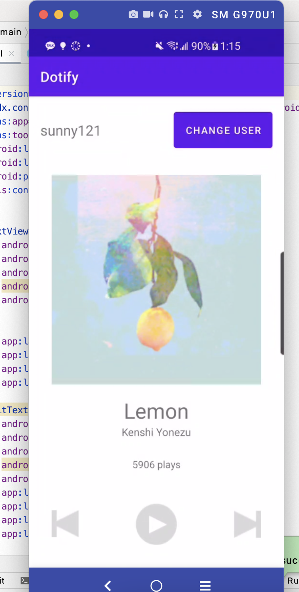

# Dotify

## HW1 - Layouts & Events

### This app shows the simple view of the first main page of the Dotify app

**Extra credits I have done**

1. A user is not allowed to apply a new username if the edit text field is empty. (+ 0.25)
2. Long pressing on the cover image changes the text color of the play count to a different color. (+ 0.25)
3. If using ConstraintLayout, utilize a Barrier or Guideline somewhere with a view constrained to it (+0.25)
4. All hardcoded dimensions & colors are extracted into res/values/dimens.xml & res/values/colors.xml
respectively (+ .5)

